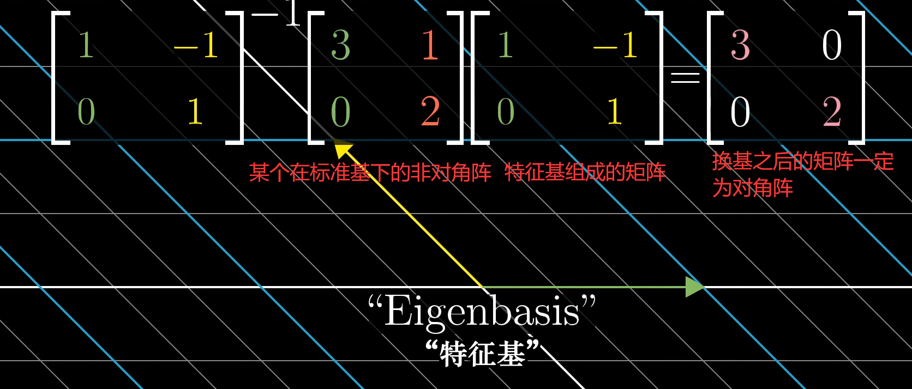

# 线性代数的本质理解

## 1，向量是什么

### 1.1，不同人眼中的向量

在物理学家眼中，向量就是一个具有长度和方向的箭头

但是在计算机科学家眼里，向量就是一个有序的数字列表

其实这两种看法都对，而且可以互相转化

每个数字列表给出一个唯一的向量

而每一个向量刚好和一个数字列表对应

### 1.2，向量的两种运算

向量的**加法(线性组合)**和**数乘**

## 2，线性组合，张成的空间和基

1，**线性组合**即为将标量与向量相乘，并将这些项相加的。

2，**所有**可以表示为给定向量的**线性组合**的**向量集合**称为“**给行向量张成的空间**”，而给定的向量就称为该向量空间的**基向量。**

3，空间中的**任意向量**都可以表示为基向量的线性组合。

4，若是向量组中的一些向量

​	1，落在其余向量张成的向量空间之内，

​	2，或者表示为一些向量可以被其余向量线性表示，

​	3，或者表示为其中一些向量对张成的空间没有任何贡献，

​	即该向量组中的向**量线性相关**。

5，若是向量组中的任意一个向量都不能由其他向量的线性组合表示则表示该向量组**线性无关**。

6，**严格定义**：向量空间的一个基是章程该空间的一个线性无关的向量集。

## 3，矩阵和线性变换

首先是**变换**

**变换**即为函数或者映射，给定一个向量可以由该变换生成一个唯一的对应的向量

“**变换**”一词暗示我们可以用运动的角度理解这种映射

**完整的变换**即为空间中的为空间中的每一个向量都做此种变换

可以理解为向量空间的“**变形**”

**线性**分为两点

1. 变换前后直线仍然是直线
2. 变换前后原点的位置不变

**总结**：

1，线性变换是操纵向量空间的一种手段，它保持网格线平行且等距分布，并且保持原点不动。

2，这种变换只需要几个数字就能描述清楚，这些数字就是基向量变换后的坐标。

3，以这些坐标为列构成的矩阵为我们提供了一种描述线性变换的语言，而矩阵向量乘法就是计算线性变换作用于给定向量的一种途径。

4，重要的是，每当看到一个矩阵的时候，都可以将其解读为对空间的一种特定变换。 

## 4，矩阵乘法和线性变换复合

1，两个矩阵的相乘有着几何意义，也就是两个线性变换的相继作用

2，如上述矩阵乘法可以理解为对向量空间先做旋转变换，在做剪切变换，复合矩阵表示捕捉到了旋转然后剪切的相同总体效应。

3，这个复合矩阵即为最初两个**矩阵的积**。

4，或者可以将最后一个矩阵理解为基向量，它左边的矩阵即为将某种线性变换作用于基向量的每一个分量。

5，矩阵的乘法不可逆，**MN**≠**NM**

## 5，行列式

1，行列式的意义即为通过矩阵变换将原来的向量空间“缩放”的比例。若是取负数即表示将该空间反转。

如上述行列式为6，即表示将向量空间扩大为原来的6倍

2，若一个行列式为0，说明该矩阵表示的变换将整个空间压缩到了更低维度，即该矩阵的列必然线性相关。

## 6，逆矩阵，列向量与零空间

1，矩阵是线性变换，逆矩阵就是对应线性变换的逆变换，使得一个标准向量空间在唯一经历该变换和其逆变换之后回到自身。

注：即使不存在逆矩阵，线性方程组仍然可能存在解

2，秩即为变换后的向量空间的维数，即列空间的维数

3，列空间：即为以该矩阵为列构成的基所张成的空间

4，零空间：若是一个矩阵的列向量线性相关，即该矩阵所代表的线性变换将原本的空间维数压缩，那么会有一系列的向量在变换后成为零向量，这些向量的集合称为零空间

5，对线性方程组的理解：Ax = v

其中x为未知量组成的列向量，v表示已知向量，A表示一个矩阵或者说一种线性变换

求解这个方程组的集合意义就在于找到一个向量x，使其在经过A的变换之后与v重合。

若是A的秩为n，则只有一个解，因为只能找到唯一的一个向量经过该不降维的线性变换变换与v重合。

6，齐次线性方程组的理解：Ax = 0

若是A的秩为n，则只有零解，因为只有零向量在经过该不降维的线性变换变换与零向量重合。

若是A的秩为m(m<n)，则有n-m组线性无关的解。因为A变换将空间压缩了n-m维，则有n维空间中的某个过原点的n-m维中的每个向量都被压缩到了零点，用n-m个线性无关的向量表示该n-m维空间，每个向量代表一组解。

## 7，点积与对偶性

略

## 8，叉乘的标准介绍

两个向量叉乘的结果为一个新的遵守右手定则的向量，其长度为原来两个向量围成的平行四边形的面积

## 9，基变换

1，不同的基代表不同的视角，但是描述的都是同一个空间。若是将另一个基作为矩阵，记为A，那么两个矩阵之间的向量变换如下：

2，可以用以下方式将我们视角下的变换转化为Jenifer视角下的变换。

注：上述文字改为A^-1MA暗示一种数学上的，其中的M表示标准视角下的变换，而两侧的两个矩阵表示一种转移作用，也就是一种视角下的转换，将该变换从我们的视角转移到另一种视角。

注：对相似矩阵的理解：P^-1AP = B

从线性变换的角度理解矩阵，将P理解为表示相同向量空间的另一个基，

上式左边从右往左看，P表示从P基的视角转换为标准视角，在进行A变换，再换回P基的视角，右边B就表示在P基的视角下的相同线性变换。

## 10，特征向量与特征值

1，特征向量

在向量空间的线性变换中，有一些向量会偏离它所张成的空间(即它原来所在的那条直线)，但是有些向量则不会偏离，线性变换对它们的作用仅仅是伸缩而已，这些向量就叫做特征向量。

2，特征值

特征向量被伸缩的比例即为特征值。

3，特征基

若标准向量空间的基向量刚好是特征向量的话，那么该矩阵则是对角阵。对角阵有很多优秀的性质，比如说在做多次乘法的时候很好算。

若我们将n维空间刚好有n个特征向量，那么我们就可以变换坐标系，使得这些特征向量就是基向量。

以特征基作为基的向量空间中，该矩阵一定是对角阵。对角阵有很多优秀的性质，比如说在做多次乘法的时候很好算。

因此我们在进行某些非对角阵运算的时候，可以先变换到特征基，完成运算之后在转换回标准坐标系：

注：关于特征值与特征向量计算方法的理解

