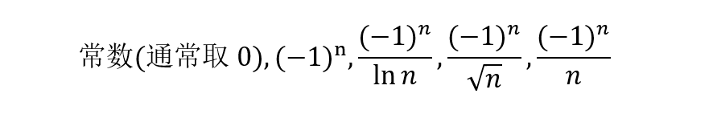

## 无穷级数做题经验

## 1，数项级数

### 1.1，具体级数判敛

#### 1.1.1，使用P级数和广义P级数作为判断标尺

#### 1.1.2，比值判别法和根值判别法

#### 1.1.3，比较判别法及其极限形式

#### 1.1.4，对数判别法

### 1.2，抽象级数判敛

#### 1.2.1，常用反例

#### 1.2.1，常见可能收敛或发散趋势

**重要结论**：

- 收敛+收敛=收敛
- 收敛+发散=发散
- 发散+发散=收敛/发散
- 绝对+绝对=绝对
- 绝对+条件=条件
- 条件+条件=绝对/条件

**可能收敛：**

- 正项级数变交错项级数
- 升阶
- 加括号

**可能发散**：

- 加绝对值
- 降阶

## 2，幂级数

### 2.1，展开

在某x=k展开，就构造f(x-k)，再套用常用和函数。

### 2.2，求和

#### 2.2.1，具体级数

1. 使用先导后积或先积后导公式套用常见和函数
2. 微分方程

#### 2.2.2，抽象级数

对于**通项为两个通项相加减**的，写出前几项尝试找出规律。

对于**给出递推关系**的题目，首先尝试根据递推关系写出通项的表达式，

写不出表达式的尝试构造微分方程求解。