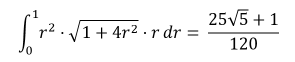

# 多元函数积分学要点

## 三重积分

1，先根据图形的特点选用投影穿线法与定线截面法

2，注意对称性的运用

## 第一型曲线曲面积分

计算时遵循以下步骤：

1，找出投影曲面或曲线

2，代换被积函数(常用对称性消去一部分被积函数，要注意)

3，微元代换(容易忘记；被积函数中存在很复杂的根式的时候往往会由微元代换产生的根式消掉)

一些技巧：

1，对于顶为平面的锥，用柱面坐标系更好计算

## 第二型曲线积分

1，注意不能使用对称性

2，在轨迹为圆的一部分时，使用参数法代换会很容易计算(注意参数的范围可能是反向的)

3，在被积函数较为简单的时候，考虑直接计算；较为复杂时考虑用格林公式

4，在使用格林公式和斯托克斯公式的时候切记要根据方向带上正负号"±"

5，在旋度为0时换积分路径的时候，要记住若是原路径包含奇点，则不可以直接由起点指向终点，而是要绕一圈。详见高数18讲习题18.19

6，容易与微分方程结合出题

7，可能会求二元全微分的原函数

8，一个常见的定积分

## 第二型曲面积分

1，有的面不好计算或者无法求出投影区域，此时使用转换投影法转换到容易计算的面

2，较为简单的被积函数直接计算

3，使用高斯公式的时候切记要根据方向带上正负号"±"

4，注意第二型积分不能使用对称性

5，注意不能曲线积分可以带入边界，而曲面积分则不行，因为曲线积分的积分区域是＝号，而曲面积分的积分区域是≤号，只有边界满足等式，而曲面内部则不满足

